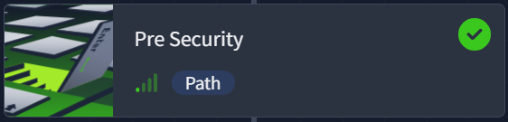

# Cybersecurity Learning Journal

## Current Progress

### TryHackMe
- ✅ Pre Security (completed)

- Cyber Security 101 (ongoing)

## Weekly Journal
- Week 1: Pre Security completed and Cyber Security 101 started

## Repository Structure

- TryHackMe/ - Learning path and module notes
- Tools/ - Tool notes and cheatsheets
- Learning-Journal/ - Weekly progress updates
- Labs/ - Notable labs and write-ups
- Assets/ - Images and screenshots

## Goals

- Building a strong cybersecurity foundation
- Documenting my learning journey
- Develop practical security skills
